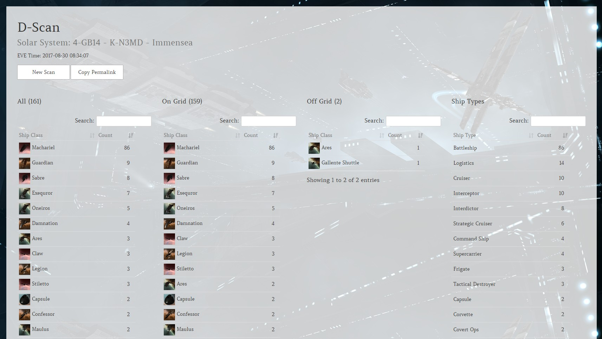
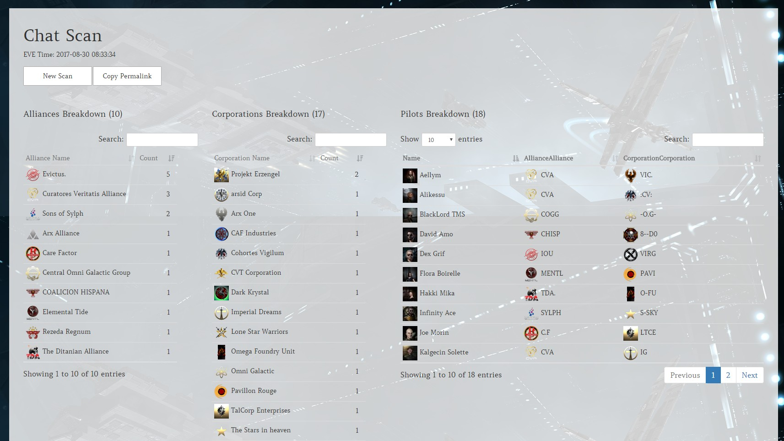
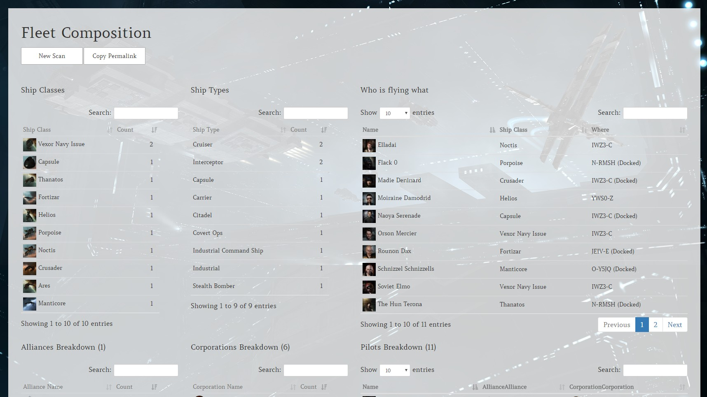
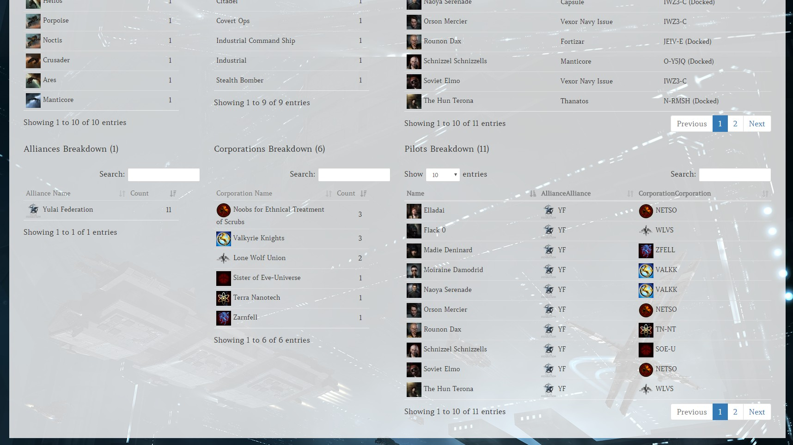

# EVE Online Intel Tool for WordPress

An easy way to parse D-Scans, fleet compositions and your local, and get all the data you might need.

### Screenshots
#### D-Scan

#### Chat Scan (Local for example)

#### Fleet Composition

### Hint
This plugin works best with WordPress themes utilizing the Bootstrap Framework. If your Theme doesn't use it, you might end up having to tweak it here and there a bit.
Works best with the [EVE Online WordPress Theme](https://github.com/ppfeufer/eve-online-wordpress-theme)

### Requirements
- WordPress 4.7 or newer
- PHP 7.1 or newer

### Installation
- Simply [download the archive](https://github.com/ppfeufer/eve-online-intel-tool/archive/master.zip) or one of the [releases](https://github.com/ppfeufer/eve-online-intel-tool/releases)
- Unzip it
- Rename the folder to `eve-online-intel-tool` (This is important, otherwise automatic updates might not work as expected)
- Copy the folder into your plugin directory in your WordPress installation.

### Set Up
After activating the Plugin, create a page called "Intel" and set the "EVE Intel" Template to it. You can leave this page empty, whatever you write on it, it won't show up anyways. Now go to Settings > Permalinks and click "Save Changes" button to make sure the new links will be generated.

### Additional Information
- [License](LICENSE)
- [Changelog](CHANGELOG.md)
